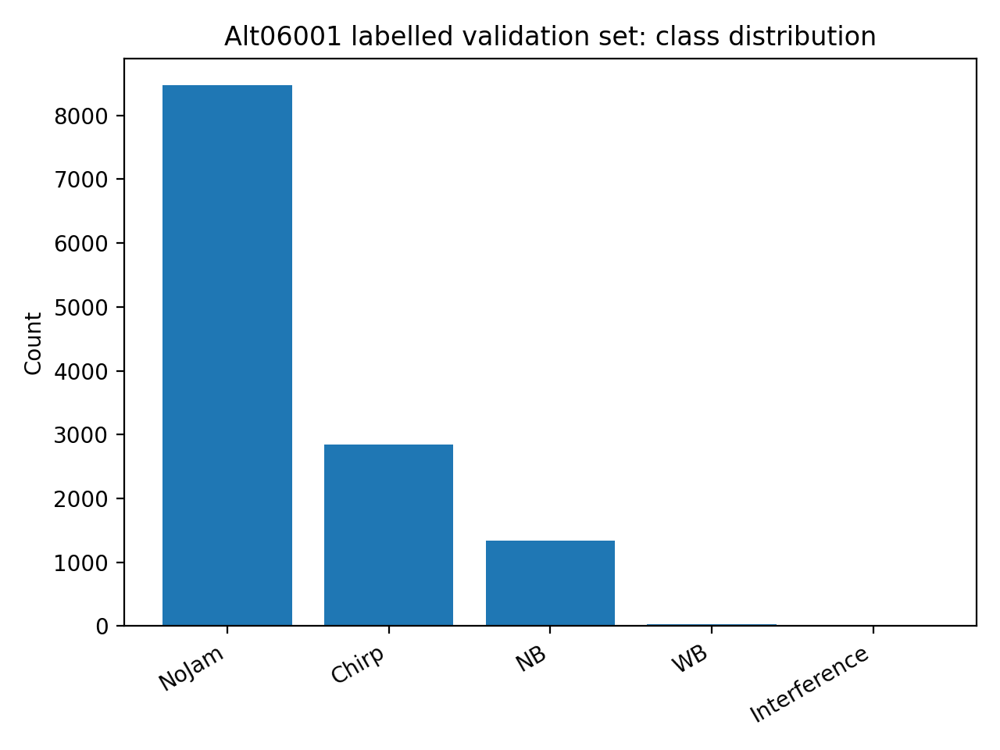

# 2. Data

This project uses three datasets:

1. **Synthetic IQ tiles** generated with MATLAB (controlled ground truth).
2. **Real labelled IQ tiles** from Jammertest 2023 (used for retraining and quantitative validation).
3. **Roadtest IQ tiles** (unlabelled) used for qualitative testing and operational sanity checks.

---

## 2.1 Core data unit: an IQ tile

All models operate on short tiles of complex baseband samples:

- Each sample is complex: $z[n] = I[n] + jQ[n]$
- A tile is a fixed-length vector of complex samples (typical: **2048 samples**)
- Tiles are classified independently.

Tile duration depends on the sampling frequency $f_s$:

$$
T_\text{tile} = \frac{N}{f_s}
$$

For $N=2048$ and $f_s = 60\,\text{MHz}$, $T_\text{tile} \approx 34.13\,\mu\text{s}$.

---

## 2.2 Synthetic dataset (MATLAB GNSS_generator)

Synthetic data is produced with:
- GNSS_generator: https://github.com/macaburguera/GNSS_generator

The generator produces `.mat` files arranged by split and class:

```
<BASE>/
  TRAIN/<Class>/*.mat
  VAL/<Class>/*.mat
  TEST/<Class>/*.mat
```

Each `.mat` contains at minimum:
- `GNSS_plus_Jammer_awgn`: complex IQ vector

This is the exact format expected by this repository’s training scripts.

### Synthetic DL dataset (stored run metadata)

This repository stores the *exact* synthetic training configuration used for the main DL baseline in:

- `artifacts/jammertest_sim_DL/spec_run_20251215_230651/run_meta.json`

Key parameters:

| Parameter | Value |
|---|---:|
| Sampling frequency | 60000000 Hz |
| Tile length | 2048 samples |
| Classes | NoJam, Chirp, NB, WB |
| JSR bins (dB) | [0, 10, 25, 40] |
| CNR bins (dB-Hz) | [20, 30, 40, 60] |
| Spectrogram | NFFT=256, WIN=256, HOP=64 |
| Spectrogram mode | `logpow` |
| Normalization | `zscore` |
| FFT shift | True |
| Augmentation | AUGMENT=True, TIME_SHIFT=True, CFO_JITTER=False |
| Training | batch=256, epochs=80, lr=0.001, weight_decay=0.001 |

Synthetic split sizes (counts per class):

| Split | NoJam | Chirp | NB | WB |
|---|---:|---:|---:|---:|
| Train | 2000 | 2000 | 2000 | 2000 |
| Val | 1500 | 1500 | 1500 | 1500 |
| Test | 1500 | 1500 | 1500 | 1500 |

---

## 2.3 Real labelled dataset (Jammertest 2023)

Real labelled tiles are extracted and labelled using:
- sbf-labeller: https://github.com/macaburguera/sbf-labeller

The main quantitative validation uses the **Alt06001** labelled dataset (Day 1 at 150 m).

Class distribution (Alt06001):

| GT label | Count | Share |
|---|---:|---:|
| NoJam | 8470 | 66.75% |
| Chirp | 2843 | 22.41% |
| NB | 1342 | 10.58% |
| WB | 32 | 0.25% |
| Interference | 2 | 0.02% |

Visualization:



Important note: the **Interference** label has only 2 examples, so it is not statistically meaningful for per-class metrics.

---

## 2.4 Roadtest dataset (unlabelled)

Roadtest data is used to test detector behaviour in long-duration, real-world operation.

This dataset is intentionally:
- unlabelled,
- highly variable,
- used for qualitative behaviour (event persistence, clustering, false alarm density over time).

See `docs/7_Test_Rodby.md` for how roadtest results are interpreted in this project.

---

## 2.5 Why both synthetic and real data?

Synthetic data enables:
- balanced classes,
- controlled JSR/CNR sweeps,
- repeatable experiments.

But synthetic data cannot perfectly replicate:
- receiver front-end non-idealities,
- real RF environment texture,
- jammer diversity and deployment artefacts.

Therefore, **domain adaptation on real labelled tiles** is central for robust performance (see `docs/6_Validation_extended.md`).

---

## 2.6 Repo-local references

- Synthetic training config: `artifacts/jammertest_sim_DL/spec_run_20251215_230651/run_meta.json`
- Feature-prep config: `artifacts/jammertest_sim/prep_run_20251215_220949/meta.json`
- Validation outputs: `results/alt06001_eval_*/`
