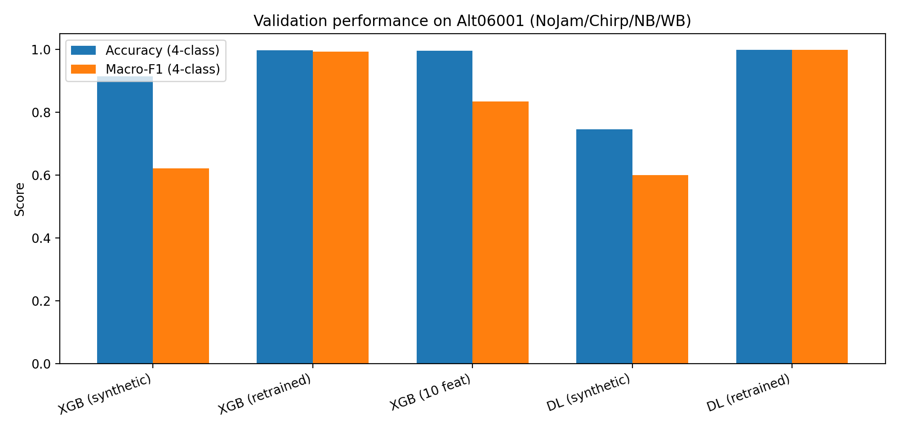
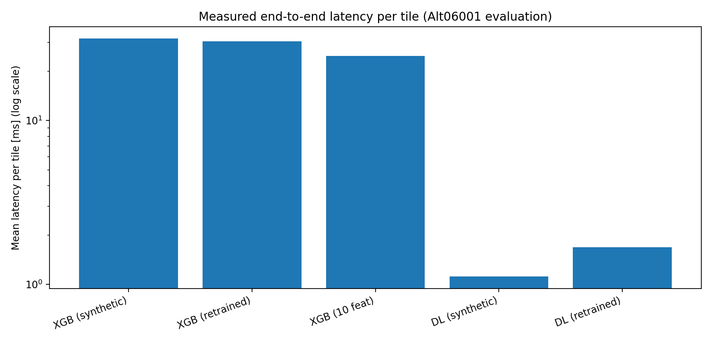

# 5. Deep Learning: Spectrogram SE-CNN

This project includes a deep learning classifier that operates on **spectrograms** derived from IQ tiles.

Pipeline summary:
1. IQ tile $z[n]$ → STFT spectrogram
2. 2D CNN classifier (SE-CNN)
3. Optional retraining on labelled real data

---

## 5.1 Why a spectrogram CNN?

Jammer types have characteristic time–frequency patterns:

- NB: a narrow spectral peak persistent over time
- WB: broadband elevated energy (raised noise floor)
- Chirp: a diagonal ridge (frequency sweep)

A CNN can learn these patterns directly from spectrogram images, without hand-crafted features.

---

## 5.2 Spectrogram definition and parameters

The STFT is computed as:

$$
X(m,k) = \sum_n z[n] \, w[n-mH] \, e^{-j 2\pi kn/N}
$$

where:
- $N$ is FFT size,
- $H$ is hop length,
- $w[\cdot]$ is the window.

The model uses log-power magnitude spectrograms with z-score normalization.

Parameters used in the main synthetic DL run (stored in `run_meta.json`):

| Parameter | Value |
|---|---:|
| $f_s$ | 60000000 Hz |
| Tile length $N$ | 2048 samples |
| NFFT | 256 |
| Window length | 256 |
| Hop | 64 |
| Mode | `logpow` |
| Norm | `zscore` |
| FFT shift | True |

---

## 5.3 IQ-domain augmentation (exact implementation)

Augmentation is implemented in `train/train_eval_cnn_spectrogram.py` and applies:

- amplitude scaling: $\text{amp} \sim U(0.9, 1.1)$
- random phase rotation: $\phi \sim U(-\pi, \pi)$
- optional CFO jitter: $f_\text{off} \sim U(-200\,\text{kHz}, 200\,\text{kHz})$
- optional time shift: $\Delta n \in [-64, 64]$ (circular roll)

In the stored synthetic run:
- AUGMENT = True
- TIME_SHIFT = True
- CFO_JITTER = False

---

## 5.4 Model architecture (exact)

The SE-CNN used in this repo is implemented as `SpecCNN2D(..., use_se=True)`.

From the model definition in `train/train_eval_cnn_spectrogram.py`:
- channel progression: **[32, 64, 128, 192]**
- three pooling stages (MaxPool2d(2))
- global average pooling head + MLP:
  - Linear(192 → 256) + Dropout(0.2) + Linear(256 → classes)

Squeeze-and-Excitation is enabled when `MODEL="se_cnn"`.

---

## 5.5 Retraining (domain adaptation) configuration

### DL retraining (domain adaptation) configuration

The retraining script is `retrain/retrain_dl.py`. Key settings in the CONFIG block:

| Setting | Value |
|---|---:|
| SPLIT_MODE | `"random",  # "time" or "random"` |
| TRAIN_FRAC | `0.70` |
| VAL_FRAC | `0.15` |
| SEED | `42` |
| BATCH_SIZE | `128` |
| FINETUNE_EPOCHS | `50` |
| LR | `2e-4` |
| WEIGHT_DECAY | `1e-3` |
| FREEZE_BACKBONE | `True` |
| FREEZE_EPOCHS | `5` |
| PATIENCE | `25` |
| IGNORED_LABELS | `{"Interference"}` |

---

## 5.6 Validation results (Alt06001)

Summary (measured from `results/*/samples_eval.csv` and timing files):

| Model | Acc (all) | Acc (4-class) | Macro-F1 (4-class) | FAR (NoJam) | Mean latency/tile [ms] |
|---|---:|---:|---:|---:|---:|
| XGB (synthetic-only, 78 feats) | 0.913153 | 0.913297 | 0.620687 | 0.001535 | 31.657 |
| XGB (retrained, 78 feats) | 0.997163 | 0.997320 | 0.992462 | 0.001653 | 30.428 |
| XGB (retrained, 10 feats) | 0.994955 | 0.994955 | 0.833918 | 0.003306 | 24.770 |
| DL SE-CNN (synthetic-only) | 0.744582 | 0.744699 | 0.599367 | 0.325148 | 1.118 |
| DL SE-CNN (retrained) | 0.997872 | 0.998029 | 0.997511 | 0.002597 | 1.688 |

Performance plot:

Latency plot (log scale):

---

## 5.7 Interpretation: synthetic→real gap

The strongest empirical finding is the domain gap:

- **DL trained only on synthetic data** has high FAR on NoJam.
- **DL retrained on real labelled tiles** achieves near-perfect performance and low FAR.

Numerically (Alt06001):
- DL synthetic-only FAR(NoJam) ≈ 0.325
- DL retrained FAR(NoJam) ≈ 0.002597

---

## 5.8 Where to find detailed outputs

- `results/alt06001_eval_dl_synthetic/`
- `results/alt06001_eval_dl_retrained/`

These folders include:
- confusion matrices
- per-tile predictions
- `timing_summary.json` (npz_load, spectrogram, inference, total)

---

## 5.9 Takeaways (DL)

- Synthetic-only DL is not deployable due to false alarms.
- After retraining, DL matches or exceeds XGB accuracy while being ~10–30× faster per tile.
- DL is the preferred pipeline when throughput/latency is a primary constraint.
