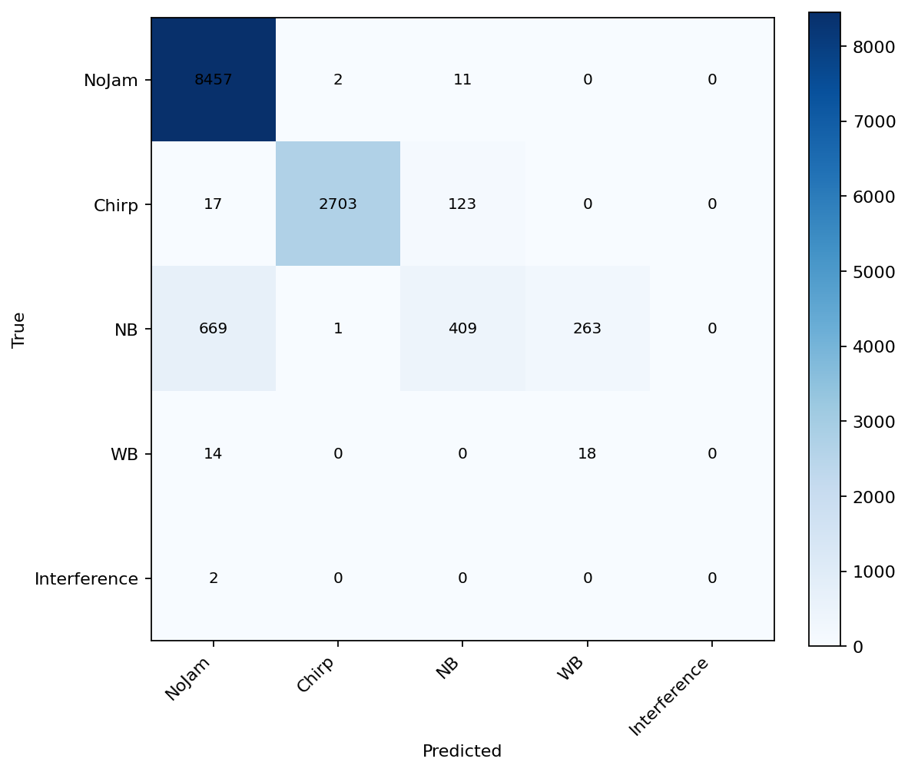
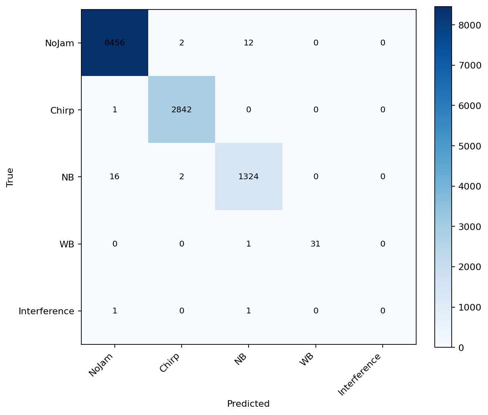
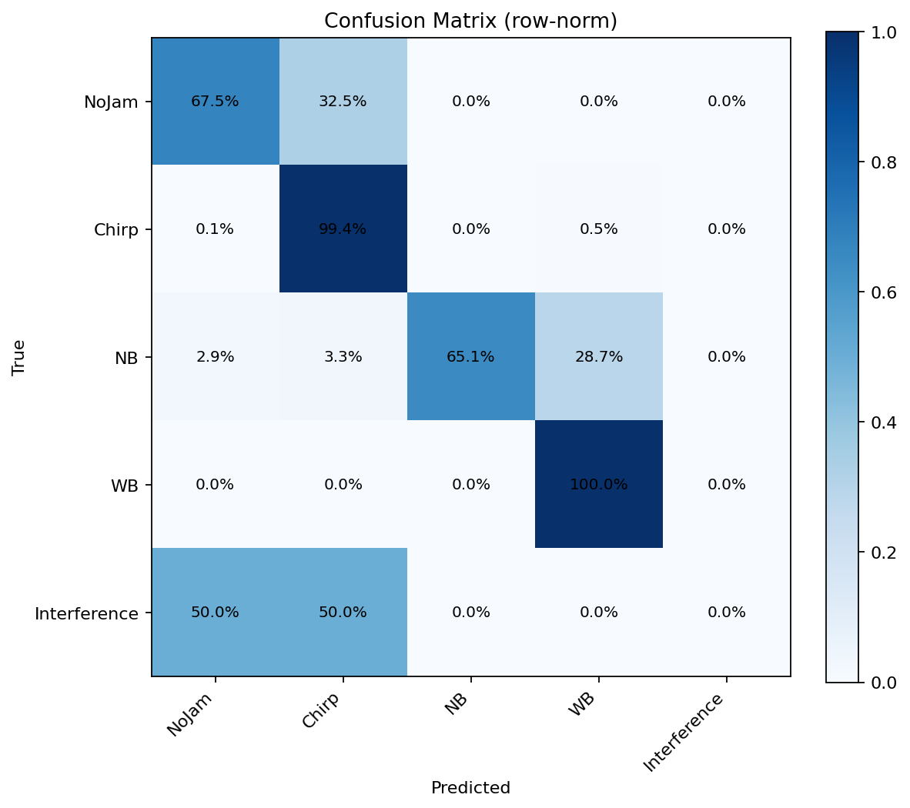
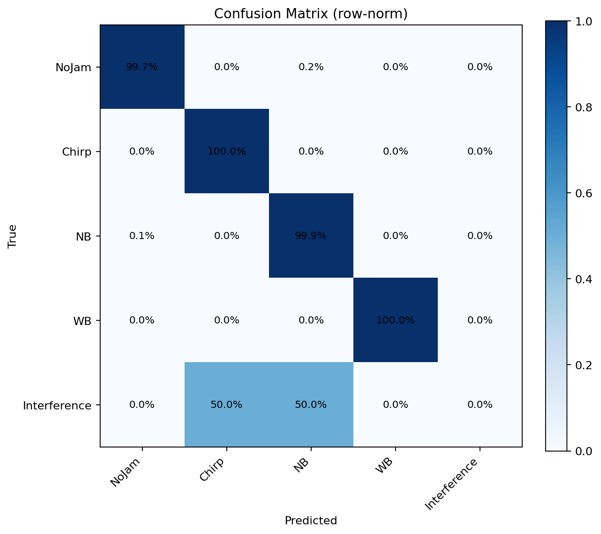

# 6. Validation (Extended)

This document reports the **final, measured** validation results for all models on the same labelled real dataset, and **replaces** any earlier approximate numbers.

All metrics below are computed from the per-sample outputs in:

- `results/*/samples_eval.csv`
- `results/*/summary.json`
- `results/*/timing_summary.json` (DL)

---

## 6.1 Dataset and evaluation protocol

**Dataset**
- Campaign: **Jammertest 2023**
- Day: **Day 1**
- Receiver: **Altus06**
- Scenario: **150 m**
- Labels: `alt06001_labels.csv`
- Evaluated blocks: **12,689** (block-wise evaluation)

**Class distribution (ground truth)**

| GT label | Count | Share |
|---|---|---|
| NoJam | 8470 | 66.75% |
| Chirp | 2843 | 22.41% |
| NB | 1342 | 10.58% |
| WB | 32 | 0.25% |
| Interference | 2 | 0.02% |

Notes:
- The dataset is **highly imbalanced** for **WB** (32 blocks, 0.25%).
- There are **2 blocks labelled `Interference`** (0.02%). These are **not** included in the main 4-class confusion matrices, but are reported separately.

**Evaluations included (directories)**
- XGB synthetic-only: `results/alt06001_eval_xgb_synthetic/`
- XGB retrained: `results/alt06001_eval_xgb_retrained/`
- XGB retrained (10 features): `results/alt06001_eval_xgb_retrained_10feat/`
- DL synthetic-only: `results/alt06001_eval_dl_synthetic/`
- DL retrained: `results/alt06001_eval_dl_retrained/`

---

## 6.2 Summary metrics (corrected)

Two accuracies are reported:
- **Acc (all)**: includes the 2 `Interference` blocks (when present in `samples_eval.csv`).
- **Acc (4-class)**: computed on **NoJam / Chirp / NB / WB** only.

| Model                           | Acc (all) | Acc (4-class) | Macro-F1 (4-class) | FAR NoJam | Recall NB | Recall WB | Mean ms/block |
| ------------------------------- | --------- | ------------- | ------------------ | --------- | --------- | --------- | ------------- |
| XGB-78 (synthetic-only)         | 0.913153  | 0.913297      | 0.620660           | 0.15%     | 30.48%    | 56.25%    | 31.657        |
| XGB-78 (retrained)              | 0.997163  | 0.997320      | 0.992355           | 0.17%     | 98.66%    | 96.88%    | 30.428        |
| XGB-10 (retrained)              | 0.994955  | 0.994955      | 0.833918           | 0.33%     | 99.25%    | 21.88%    | 24.770        |
| DL spectrogram (synthetic-only) | 0.744582  | 0.744699      | 0.599334           | 32.51%    | 65.13%    | 100.00%   | 1.118         |
| DL spectrogram (retrained)      | 0.997872  | 0.998029      | 0.997375           | 0.26%     | 99.85%    | 100.00%   | 1.688         |

### Interpretation (what matters)
- **DL synthetic-only does *not* generalize**: very high false alarms on **NoJam** (≈32.5%).
- **XGB synthetic-only generalizes better in FAR**, but misses a large fraction of **NB** (recall ≈30.5%) and still struggles with **WB**.
- **Retraining on real data** pushes both approaches close to ceiling on this dataset.
- The **10-feature XGB** keeps strong NB performance but collapses on **WB** (WB recall ≈21.9%), mainly predicting WB as NB.

---

## 6.3 Confusion matrices (4-class)

All matrices below use **row-normalization** over the 4 primary classes (NoJam/Chirp/NB/WB).
The corresponding images are stored under `results/*/`.

### 6.3.1 XGB-78 (synthetic-only)

Row-normalized values (reconstructed from `samples_eval.csv`):

| GT \ Pred | NoJam | Chirp | NB | WB |
|---|---|---|---|---|
| NoJam | 0.9985 | 0.0002 | 0.0013 | 0.0000 |
| Chirp | 0.0060 | 0.9508 | 0.0433 | 0.0000 |
| NB | 0.4985 | 0.0007 | 0.3048 | 0.1960 |
| WB | 0.4375 | 0.0000 | 0.0000 | 0.5625 |

Key failure mode:
- **NB → NoJam** is dominant (≈49.9% of NB predicted as NoJam).

---

### 6.3.2 XGB-78 (retrained)

| GT \ Pred | NoJam | Chirp | NB | WB |
|---|---|---|---|---|
| NoJam | 0.9983 | 0.0002 | 0.0014 | 0.0000 |
| Chirp | 0.0004 | 0.9996 | 0.0000 | 0.0000 |
| NB | 0.0119 | 0.0015 | 0.9866 | 0.0000 |
| WB | 0.0000 | 0.0000 | 0.0312 | 0.9688 |

Key note:
- WB has only **32** samples; the single WB error is **WB → NB** (≈3.1%).

---

### 6.3.3 XGB-10 (retrained)

Row-normalized matrix (from stored CSVs):

- Counts: `results/alt06001_eval_xgb_retrained_10feat/confusion_matrix_counts.csv`
- Row %: `results/alt06001_eval_xgb_retrained_10feat/confusion_matrix_rowpct.csv`

| GT \ Pred | NoJam | Chirp | NB | WB |
|---|---|---|---|---|
| NoJam | 0.9967 | 0.0014 | 0.0019 | 0.0000 |
| Chirp | 0.0004 | 0.9996 | 0.0000 | 0.0000 |
| NB | 0.0060 | 0.0015 | 0.9925 | 0.0000 |
| WB | 0.0312 | 0.0000 | 0.7500 | 0.2188 |

Key failure mode:
- **WB → NB** dominates (≈75% of WB predicted as NB), yielding **low WB recall**.

---

### 6.3.4 DL spectrogram (synthetic-only)

| GT \ Pred | NoJam | Chirp | NB | WB |
|---|---|---|---|---|
| NoJam | 0.6749 | 0.3248 | 0.0004 | 0.0000 |
| Chirp | 0.0014 | 0.9940 | 0.0000 | 0.0046 |
| NB | 0.0291 | 0.0328 | 0.6513 | 0.2869 |
| WB | 0.0000 | 0.0000 | 0.0000 | 1.0000 |

Key failure mode:
- **NoJam → Chirp** is extremely frequent (≈32.5%), explaining the high FAR.

---

### 6.3.5 DL spectrogram (retrained)

| GT \ Pred | NoJam | Chirp | NB | WB |
|---|---|---|---|---|
| NoJam | 0.9974 | 0.0004 | 0.0022 | 0.0000 |
| Chirp | 0.0004 | 0.9996 | 0.0000 | 0.0000 |
| NB | 0.0015 | 0.0000 | 0.9985 | 0.0000 |
| WB | 0.0000 | 0.0000 | 0.0000 | 1.0000 |

---

## 6.4 Computational performance (per block)

These timings are taken from:
- XGB: `results/alt06001_eval_xgb_*/summary.json` → `timing_summary`
- DL: `results/alt06001_eval_dl_*/timing_summary.json`

| Model | NPZ load (ms) | Feat. extract (ms) | Inference (ms) | Spectrogram (ms) | Total (ms) |
|---|---|---|---|---|---|
| XGB-78 (synthetic-only) | 0.576 | 26.553 | 2.676 | — | 31.657 |
| XGB-78 (retrained) | 0.558 | 24.999 | 3.145 | — | 30.428 |
| XGB-10 (retrained) | 0.523 | 22.098 | 2.149 | — | 24.770 |
| DL spectrogram (synthetic-only) | 0.691 | — | 0.487 | 0.345 | 1.118 |
| DL spectrogram (retrained) | 1.016 | — | 0.529 | 0.543 | 1.688 |

Important notes:
- DL timings were recorded with `device = "cuda"` (see `results/alt06001_eval_dl_*/summary.json`).
- XGB timings are wall-clock on the machine used to run the script (device not explicitly recorded in the summary).

---

## 6.5 Behavior on `Interference` (2 blocks)

`Interference` appears only twice in the label file. Results should not be over-interpreted.

| Model | Rows in samples_eval.csv | Predictions on GT=Interference (2 blocks) |
|---|---|---|
| XGB-78 (synthetic-only) | 12689 | NoJam: 2 |
| XGB-78 (retrained) | 12689 | NB: 1, NoJam: 1 |
| XGB-10 (retrained) | 12687 | not present / filtered |
| DL spectrogram (synthetic-only) | 12689 | NoJam: 1, Chirp: 1 |
| DL spectrogram (retrained) | 12689 | NB: 1, Chirp: 1 |

The 10-feature XGB evaluation produced a `samples_eval.csv` with **12,687** rows (i.e., the 2 `Interference` rows are not present there).

---

## 6.6 Key conclusions from validation

1. **Domain gap is real and measurable**
   - DL trained purely on synthetic spectrograms shows severe mismatch (NoJam→Chirp false alarms).
   - XGB synthetic-only is more conservative (low FAR) but under-detects NB and partly WB.

2. **Retraining on real data is decisive**
   - Both XGB-78 and DL reach ~0.997–0.998 accuracy on the 4-class subset after retraining.

3. **Feature reduction trades robustness**
   - The 10-feature model improves speed but loses WB discrimination, suggesting WB requires the broader feature set (or explicit WB-focused augmentation / rebalancing).

4. **WB metrics are statistically fragile**
   - With **32** WB blocks, even 1–2 errors shift recall notably. Any claims about WB should be phrased with this in mind.

---

## 6.7 Reproducibility (exact files)

To regenerate the reported metrics, use these files:

- Per-sample predictions:
  - `results/alt06001_eval_xgb_synthetic/samples_eval.csv`
  - `results/alt06001_eval_xgb_retrained/samples_eval.csv`
  - `results/alt06001_eval_xgb_retrained_10feat/samples_eval.csv`
  - `results/alt06001_eval_dl_synthetic/samples_eval.csv`
  - `results/alt06001_eval_dl_retrained/samples_eval.csv`

- Summary + timing:
  - `results/*/summary.json`
  - `results/alt06001_eval_dl_*/timing_summary.json`
